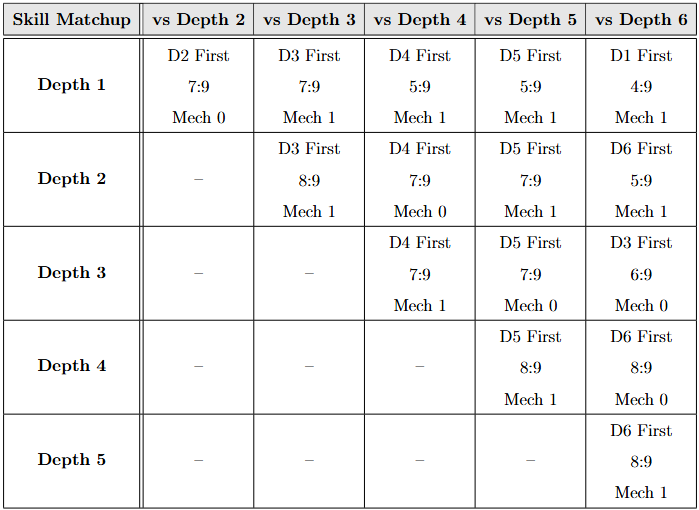
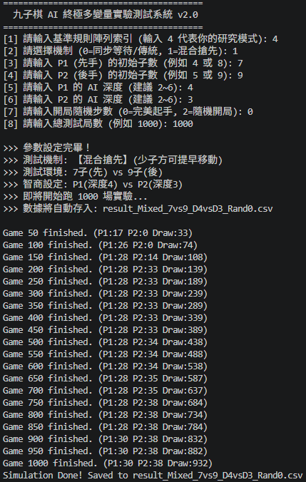

# 非對稱九子棋之讓子勝率分析與玩家評分系統

## Handicap Win-Rate Analysis and Player Rating System in Asymmetric Nine Men's Morris

國立清華大學資訊工程學系碩士論文研究  
主要使用語言：**C++**

---

## 研究簡介

本研究探討 **非對稱九子棋（Asymmetric Nine Men's Morris）** 中，
不同棋子數量、AI 強度與遊戲機制對勝率及遊戲平衡性的影響。

若僅透過棋子數量進行讓子，
不同配置之間的勝率可能產生較大的離散變化，
不利於建立細緻的玩家難度與配對系統。

因此，本研究除分析不同讓子條件下的勝率外，
亦提出 **Mixed Preemptive Rule**：
當少子方率先完成棋子放置後，
可提前進入移動或飛行階段，
藉此引入額外的時間／步數優勢。

透過：

- 棋子數量差
- AI 強度
- 遊戲機制
- 自動化 AI self-play
- 勝率與 Expected Score 分析
- 數學邊界條件分析

本研究建立非對稱讓子勝率矩陣，
並進一步設計玩家能力分級、關卡及配對機制。

---

# 核心研究貢獻

## 1. Mixed Preemptive Rule

本研究提出 **Mixed Preemptive Rule**，
目的在於增加非對稱讓子系統的勝率調整維度。

在傳統同步放置規則中，
雙方通常需完成所有棋子的放置後，
才能進入後續移動階段。

在 Mixed Preemptive Rule 中，
若少子方先耗盡手中的棋子，
即可提前進入移動或飛行階段，
不必等待多子方完成放置。

因此，遊戲平衡可同時受到三種因素影響：

- **Spatial Handicap**：棋子數量差所造成的空間資源差異
- **Temporal Advantage**：少子方提前移動所取得的時間／步數優勢
- **AI Strength**：不同 AI 強度所造成的決策能力差異

此機制將空間資源優勢與時間優勢分離，
使讓子條件具有更細緻的平衡調整能力。

---

## 2. C++ 研究平台修改與自動化實驗

本研究基於既有開源 Nine Men's Morris 遊戲與 AI 程式進行修改與擴充。

原始遊戲引擎與 AI 並非由本人從零開發。

本人針對研究需求修改既有 C++ codebase，加入：

- 調整與整合既有 AI 強度參數
- 非對稱棋子數量配置
- Mixed Preemptive Rule
- 自動化 AI 對戰流程
- 實驗結果紀錄與資料蒐集功能

透過不同：

- AI 強度
- 棋子數量
- 遊戲規則

的組合進行自動化 self-play。

本研究共建立 **71 組實驗配置**，
每組固定執行 **1,000 場 AI 對戰**，
累計完成 **71,000 場自動化對局**。

每組實驗記錄：

- P1 勝場
- P2 勝場
- 和局數
- Win Rate
- Draw Rate
- Expected Score

作為後續勝率矩陣、玩家能力評估與關卡設計的分析基礎。

---

## 3. 非對稱讓子勝率矩陣

根據不同 AI 強度與讓子條件下的自動化對戰結果，
建立 **Handicap Win-Rate Matrix**，
用以量化不同配置之間的遊戲平衡程度。

勝率矩陣可用於分析：

- 不同 AI 強度之間的實力差
- 不同棋子數量讓子的影響
- Mixed Preemptive Rule 對勝率的修正效果
- 不同配置下玩家的預期得分

並作為：

- 玩家能力推估
- 難度分級
- 關卡設計
- 公平配對

的依據。

---

# My Contributions

本人在本研究中的主要工作包括：

- 閱讀並修改既有 C++ 九子棋 codebase
- 設計並實作 **Mixed Preemptive Rule**
- 建立 AI 強度、棋子數量與遊戲機制的參數化實驗架構
- 建立自動化 AI self-play 與資料蒐集流程
- 建構非對稱讓子勝率矩陣
- 分析不同遊戲配置下的勝率、和局率與 Expected Score
- 設計玩家 Tier、能力評估與關卡系統
- 將勝率資料應用於玩家評分與公平配對
- 進行非對稱局面的數學邊界條件分析
- 結合模擬實驗與理論分析建立完整研究流程

---

# Research Workflow

研究流程可概括為：

1. 閱讀並理解既有開源 C++ 九子棋程式
2. 修改系統以支援非對稱棋子配置與參數化 AI
3. 設計並實作 Mixed Preemptive Rule
4. 執行不同配置下的自動化 AI self-play
5. 建立勝率矩陣並分析遊戲平衡
6. 根據實驗結果設計玩家能力 Tier 與關卡
7. 進行部分極端非對稱局面的理論分析

更完整的研究方法請見：

[docs/methodology.md](docs/methodology.md)

---

# Experimental Results

## Win-Rate Matrix

本研究針對 **71 組不同 AI 強度、棋子數量與遊戲機制配置**，
每組執行 1,000 場自動化 AI self-play，
累計分析 **71,000 場對局**，
並依據實驗結果建立非對稱讓子勝率矩陣。



勝率矩陣主要用於尋找不同玩家能力與 AI 強度之間，
較接近平衡勝率的讓子條件。

---

## Automated Self-Play

以下為自動化 AI 對戰與實驗執行流程的示意：



---

## Experimental Data

完整實驗資料與分析檔案：

- [Raw Match Results](results/raw-match-results.xlsx)
- [Summarized Results](results/summarized-results.xlsx)
- [LaTeX Analysis Source](results/summarized-analysis.tex)

Excel 檔案保存不同 AI 強度、棋子配置與遊戲機制下的對戰統計；
LaTeX 檔則包含論文中使用的整理後分析內容。

---

# 玩家關卡與能力評估

本研究根據實驗勝率與 Expected Score，
設計不同 Tier 的玩家能力評估關卡。

Expected Score 定義為：

\[
E = WinRate + 0.5 \times DrawRate
\]

其中勝利計 1 分、和局計 0.5 分、失敗計 0 分。

關卡並非單純依照 AI 強度排序，
而是同時考量：

- AI 強度
- 玩家與 AI 的棋子數量差
- 遊戲規則
- 勝率
- 和局率
- Expected Score

藉此建立不同難度與策略需求的測試環境。

## 代表性關卡

| Tier | Target Skill | Representative Setting | Experimental Result |
|---|---:|---|---|
| Bronze | 2 | Player 7 vs AI 1, Sync | Win Rate 56.7% |
| Silver | 3 | Player 8 vs AI 1, Sync | Win 21.6%, Draw 78.4%, E = 60.8% |
| Gold | 4 | Player 7 vs AI 2, Sync | Win 17.2%, E = 50.6% |
| Platinum | 5 | Player 7 vs AI 2, Mixed | Win 4.4%, Draw 89.1%, E = 48.95% |
| Diamond | 6 | Player 8 vs AI 5, Mixed | Win 22.8%, Draw 55.7%, E = 50.65% |

部分關卡以 **Expected Score 接近 50%**
作為相對平衡的能力評估條件。

---

# 理論分析與邊界條件

除模擬實驗外，
本研究亦針對部分極端非對稱局面進行數學分析。

## 3-vs-4 Handicap Game

考慮：

- P1：3 枚棋子
- P2：4 枚棋子

### Traditional Synchronous Placement

在傳統同步放置規則下，可證明：

> 若 P2 採取最佳策略，4-piece side P2 可以強制取得勝利。

證明的主要想法為：

1. P2 可利用高連接度位置建立進攻結構。
2. 當 P1 嘗試形成 mill 時，P2 可進行阻擋。
3. P2 可進一步建立迫使 P1 防守的成線威脅。
4. 在同步放置規則下，P1 無法在 P2 完成最後一枚棋子前取得足夠的反擊空間。
5. P2 最終可強制形成 mill，使 P1 損失棋子並進入失敗狀態。

因此，在此設定下，
3-piece side 無法避免失敗。

---

## Mixed Preemptive Rule 下的改變

採用 Mixed Preemptive Rule 後，
3-piece side 在完成第三枚棋子的放置時，
即可提前進入 Flying Phase。

此時：

- 4-piece side 尚未完成所有棋子的放置
- 3-piece side 已取得更高的移動自由
- 少子方可以快速進行 mill 防守
- 少子方亦可能利用飛行能力形成反擊

因此，
傳統同步規則中的 4-piece side 必勝邊界不再直接成立。

這說明時間優勢可以在部分極端非對稱局面中，
補償少子方的空間資源劣勢。

---

# Open-Source Attribution

本研究基於既有開源 Nine Men's Morris 遊戲與 AI 程式進行修改與擴充。

原始遊戲引擎與 AI 實作並非由本人從零開發。

本人主要針對研究需求新增或修改：

- 非對稱棋子配置
- AI 實驗參數
- Mixed Preemptive Rule
- 自動化 AI self-play
- 實驗資料蒐集
- 勝率分析與玩家能力評估流程

原始專案之授權說明聲明其 source code 遵循 LGPL v3，並包含原作者額外使用條款。

考量原始專案的授權條件，
本 repository 不重新散布完整的原始遊戲與 AI source code，
主要展示研究方法、實驗結果、分析資料及本人可獨立公開的研究內容。

---

# Repository Structure

```text
master-thesis/
├── README.md
├── docs/
│   └── methodology.md
├── figures/
│   ├── win-rate-matrix.png
│   └── automated-self-play.png
└── results/
    ├── raw-match-results.xlsx
    ├── summarized-results.xlsx
    └── summarized-analysis.tex
```

---

# Technical Topics

- C++
- Existing Codebase Modification
- Automated Simulation
- Parameterized Experiments
- AI Self-Play Experimentation
- Game Balance Analysis
- Statistical Win-Rate Analysis
- Mathematical Analysis
- Player Rating
- Matchmaking
- Difficulty / Level Design
